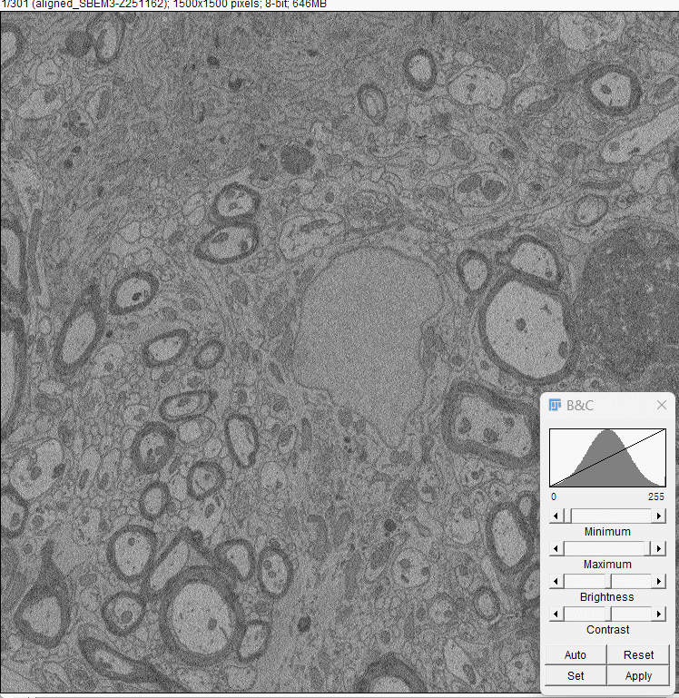

# OptimizedAcquisition4vEM

This repository contains the official implementation for our work on accelerating volume electron microscopy (vEM) through a synergistic "Fast-Scan, AI-Restore" strategy. Our method enables significant speed-ups in data acquisition while maintaining high data quality, and even pushes the boundary of achievable axial resolution in SBEM.

## Overview

Our research addresses a long-standing bottleneck in volume electron microscopy (vEM): the trade-off between imaging speed, data quality, and sample damage. We propose and validate a new paradigm, "Fast-Scan, AI-Restore," which decouples data acquisition from quality enhancement. The core idea is to acquire noisy-but-complete data at high speeds and then use deep learning models to restore high-fidelity structural information.

Ultimately, this work provides two key contributions enabled by this repository's code:
1.  A practical workflow to significantly accelerate existing vEM tasks using supervised denoising.
2.  A novel capability to achieve higher axial resolution with SBEM by applying self-supervised denoising to ultra-thin sections.


## Code Structure

The repository is organized as follows:

```
.
├── model/                             # Denoising network architectures
├── dataset/                           # Dataset loading and preprocessing
├── utils/                             # Auxiliary functions
├── ckpt/                              # Checkpoints will be saved here
├── configs/                           # Configuration files(.py)
├── log/                               # Training logs and TensorBoard files
├── figs/                              # Figures for documentation
├── data/                              # Directory for sample input stacks
├── environment_optimized_vem.yml      # Conda environment configuration
├── train_supervised_denoise.py        # Supervised training script
├── train_self_supervised_denoise.py   # Self-supervised training script
├── volume_inference.py                # Inference script
└── README.md
```

## Installation

We recommend using Conda to manage the environment for consistency and reproducibility.

1.  **Clone this repository:**
    ```bash
    git clone [https://github.com/hmzawz2/OptimizedAcquisition4vEM.git](https://github.com/hmzawz2/OptimizedAcquisition4vEM.git)
    cd OptimizedAcquisition4vEM
    ```

2.  **Create and activate the Conda environment:**
    ```bash
    conda env create -f environment_optimized_vem.yml
    conda activate optimized_vem
    ```

## Usage Guide

### 1. Data Preparation

You will need to prepare your own datasets for training.
- **Format:** Currently, the code only supports **single-stack TIF files** in 8-bit format.
- **Registration:** All volumes are assumed to be properly registered.

* **For Supervised Denoising:**
    * You need pairs of registered fast-scan (noisy) and slow-scan (clean) volumes.
    * **Important:** Please ensure your filenames contain `'fast'` and `'slow'` respectively (e.g., `my_sample_fast.tif`, `my_sample_slow.tif`). The script uses this convention to automatically identify the source and target volumes within the specified data directory.

* **For Self-Supervised Denoising:**
    * You only need a single fast-scan (noisy) volume.
    * **Crucially, the noise distribution should be as uniform as possible throughout the volume.** Significant variations in brightness, contrast, or noise levels between slices can degrade the performance of self-supervised methods.
   <table>
      <tr>
         <td align="center"><b>non-uniform noise distribution</b></td>
         <td align="center"><b>uniform noise distribution</b></td>
      </tr>
      <tr>
         <td></td>
         <td></td>
      </tr>
   </table>

### 2. Configuration

This project uses configuration files located in the `configs/` directory instead of command-line arguments. Before running any script, please **edit the corresponding `.py` config file** to set parameters such as data paths and experiment names.

### 3. Training

Once your configuration file is set up, you can start training. The training process typically requires about 30 epochs for supervised model and 80 epochs for self-supervised model to converge. The final model checkpoint (`checkpoint.pth`) saved at the end of training is recommended for inference.We offer two pretrained model (both ckpt/Fig2/supervised.pth and ckpt/Fig3/self-supervised.pth) for users. It is recommanded for users to use supervised.pth first, as it had trained on supervision.


* **To start supervised training:**
    ```bash
    python train_supervised_denoise.py
    ```

* **To start self-supervised training:**
    ```bash
    python train_self_supervised_denoise.py
    ```

### 4. Inference / Denoising

To denoise a new volume using a trained model:
1.  Edit the corresponding inference config file in `configs/`.
2.  Set the `pred_volume_dir` to your input data dir and the `load_from` to your trained model (`.pth` file). The trained model will be loaded and denoise all '.tif' files in the dir. We offer a small crop of fast scan volume on 25nm thickness (data/fast_scan_z25.tif) for users to test.
3.  Run the inference script:
    ```bash
    python volume_inference.py
    ```

## Model Details

The primary focus of this work is on the acquisition strategy and processing workflow rather than novel network architecture. The model used is a standard, robust U-Net network.

**Note:** The current implementation is optimized for stability and clarity, and thus only supports `batch_size=1` This batch size is fixed in our code.

## License

This project is licensed under the MIT License. See the `LICENSE` file for details.

## Contact

This is an initial release of our project code. We welcome any questions, bug reports, and discussions. Please feel free to open an issue on this GitHub repository or contact us via email at chenbohao2024@ia.ac.cn.